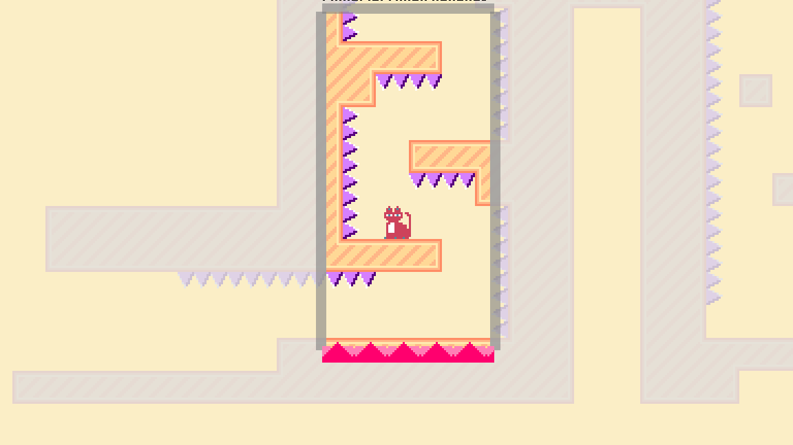
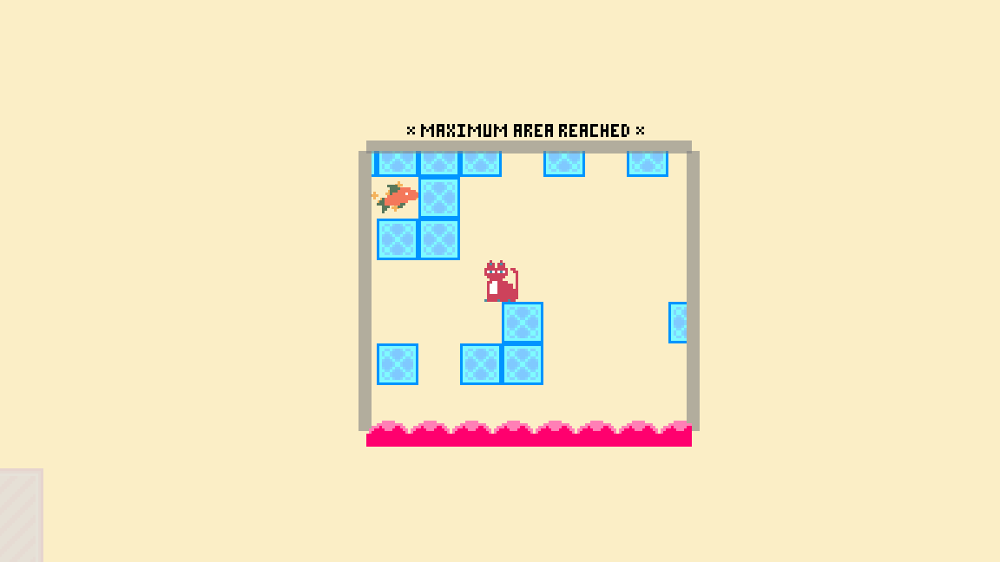
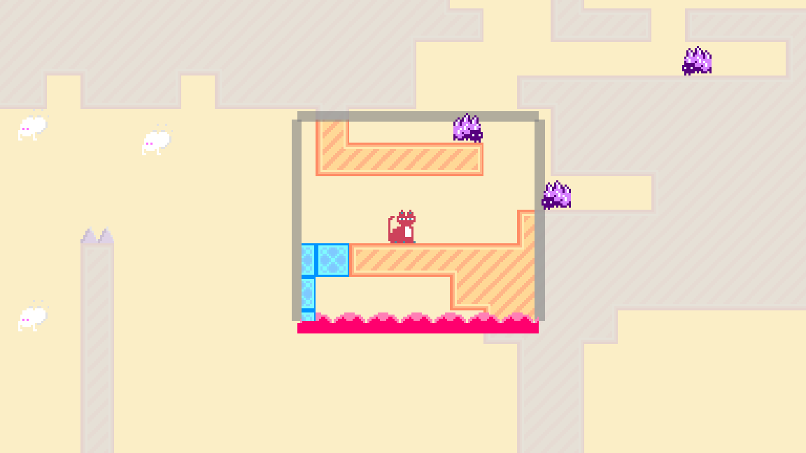

+++
title = "Box of Squingus"
description = "Ludum Dare 54 Jam Entry"
date = 2022-10-01

[extra]
era = "October 2023"
thumbnail = "thumbnail.bmp"
tags = ["Godot Engine", "Paint.NET"]
+++

This is a game I worked on as a submission for Ludum Dare 54, a 72-hour game jam that takes place a few times each year.
It was my second time participating in the game jam, and I worked with a friend to collaborative design and develop the project. 
The theme for the event was "Limited Space," and this ended up manifesting in our game's titular box mechanic.

Squingus (our heroic cat protagonist) is constrained within a box with a limited maximum area, and must surmount short obstacle courses in order to reach a fishy treat.
So while the player controls Squingus with typical platformer character movement, they must also grow and shrink the box while keeping the total boxed area below a maximum limit to provide the character space to move.
Through the basic operations of growing and shrinking any one of the four edges, the box can be moved in space (kind of like an inchworm) or changed in shape to address the challenges posed by each level.

The box is usually a bane to Squingus, hindering movement (and sometimes visibility). Initially, its presence makes it difficult to comfortably move around.
When lining up a long jump, the maximum area constraint means length comes at the cost of headroom.
Furthermore, touching the bottom of the box at any point results in death (as it is inexplicably on fire, which has some sort of thematic significance, probably).
However, there are cases where the box's constraints can be helpful -- for example, lining up the edge of a box just past a row of spikes, or below a ceiling of them, makes sure Squingus is safe in tight situations.
In later levels, some enemies begin reacting to the box's bounds, creating challenges where a smaller area of movement is safer or more desireable than a maximized-area box.

The game is fairly short, and you can [play it in your browser here!](https://sprodsoft.itch.io/box-of-squingus).
Like almost all game jam games, there are vague plans to revive it and flesh out the concept some more, so feel free to leave feedback!
