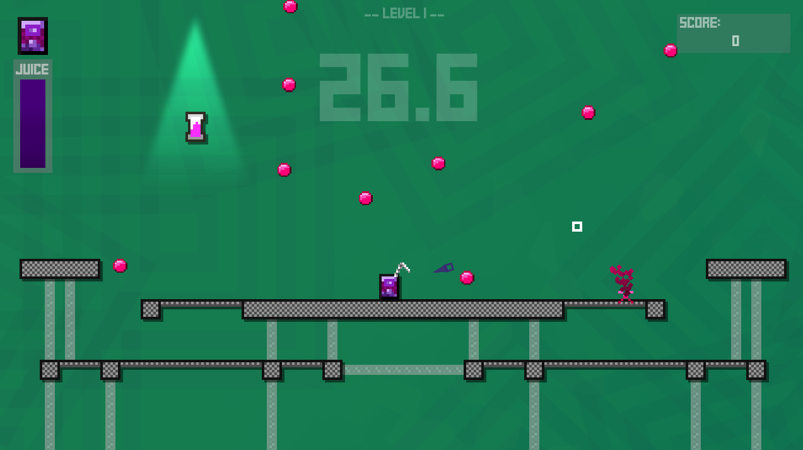

+++
title = "A Small Game About Juiceboxes"
date = 2020-09-01

[extra]
era = "September 2020"
thumbnail = "thumbnail.bmp"
tags = ["Godot Engine", "LMMS", "Paint.NET"]
+++

My first solo game project made using Godot Engine! Developed over three months in quarantine, the focus of this project was to experiment with game "juice" (hence the name) and familiarize myself with the process of developing a game from start to finish.

A sidescrolling "bullet-heck", the game involves maneuvering a juicebox around the stage while dodging pink obstacles. To discourage camping in a corner, each juicebox can activate an ability to either dodge, shield, or move around the stage at the cost of a juice resource, which can be refilled by picking up powerups that spawn near the sides of the stage. As the game progresses, the obstacles increase in frequency, intensity, and speed -- and new, tougher patterns are added to the mix.


  {{ figure(src="./jb-ss2.bmp", caption="Certain stages were designed to make certain obstacles more or less difficult. Here, the multiple levels create barriers and protect players from falling obstacles. In this stage, power-ups only spawn on the top level of platforms -- the reward of getting a power-up and refilling the player's juice meter comes at the cost of the player putting themselves in an extremely risky spot.") }}
  {{ figure(src="./jb-move.gif", caption="Early version of the game's movement. Triggering visual effects on jumping/landing made what's essentially a flat square zooming around feel like it had weight behind it. This was improved later with tweening the juicebox's scale, creating stretch and squish effects.") }}


From the start, I focused a lot on having the character movement feel good. Using a juicebox as a player object meant not having a lot of ways to convey movement through gestures, so I relied a lot on particle effects, both real and "fake" (using animated sprites instead of the engine's particle features). Making sure the jump arc felt good (and had a controllable height) was also important, since the game required very precise movement at times. Other small touches, like having the pointer react to clicks in a clear way, menu items jostle when selected, and generous use of screen shake were implemented to ensure the game felt as responsive to the player's actions as possible.

The game also featured a multiplayer mode. Last the longest to gain a point, whereupon the stage shuffles and the difficulty increases until one player hits 10. It supports up to four players, using either keyboard & mouse or gamepad. It was difficult to manage the inputs (and especially difficult to test), but I'm proud of how it came out -- learning more about how to make good party games is a particular goal of mine, so I learned a lot from developing this feature of the game especially!


  {{ figure(src="./jb-ss3.bmp", caption="The menu design lets players easily hop in or out, switch whether they're using keyboard or gamepad controls, and adjust their chosen juicebox.") }}
  {{ figure(src="./pushed.mp4", caption="Players can also act aggressively by pushing their opponents through one-way platforms.", vid="true") }}


Compared to other projects where the sound design had to more strictly adhere to a theme, the more abstract "setting" of this game let me experiment more with making sounds that had the primary focus of just sounding good. I still have a long way to go as a composer, but I enjoyed having that freedom when making the background tracks and really tried to make them varied enough such that they don't get old -- especially since the game isn't easy. For the sound effects, I tried to make them sound "juicy" and used the same synthesizer instruments to create them so they meshed together. I think they added a lot to the game feel, especially since a bunch of them play at once. One small detail is that the sounds that play when the most common obstacles spawn vary around a C minor chord, the same chord the background tracks center around, adding sort of a non-obtrusive randomized mini-melody to reflect the random distribution of obstacles during gameplay.

Finally, I implemented an achievement system within the game, letting players unlock skins and stages as they play. Since ability types are tied to juicebox skin, I made sure the player starts with one of each unlocked -- and, stage unlocks are locked behind the more straightforward achievements, I tried to make the content as accessible as possible. Figuring out ways to let the game track unlock conditions (and especially letting the player know in real-time when they get one) efficiently was a cool challenge to tackle.


  {{ figure(src="./jb-ss4.bmp", caption="Players can view a grid of all achievements, alongside their unlock conditions and rewards.") }}
  {{ figure(src="./jb-menu.gif", caption="The simple menu design draws the player's attention to the achievement unlocks as goals to shoot for straightaway.") }}


Overall, I'm really happy with how this game came out. It was tough molding it into a finished product without a clear goal at the outset, but the game feel touches and decent content scope made it end up feeling undeniably juicy.

More information / downloads at [this itch.io page](https://lucien-eckert.itch.io/juicebox)!
