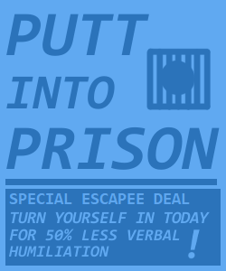

+++
title = "Parole in One"
description = "INFO/CS 3152 Team Project"
date = 2020-05-01

[extra]
era = "May 2020"
thumbnail = "thumbnail.bmp"
tags = ["Java/LibGDX", "LMMS", "Paint.NET"]
+++

Produced as a semester-long project for [INFO/CS 3152: Introduction to Game Development](http://www.cs.cornell.edu/courses/cs3152/2021sp/). I worked as a designer on a team of 8 people, primarily focusing on sound design and level design, as well as creating a few animations and facilitating playtesting sessions.

Our project's high-concept statement was as follows:

> In a world where golfing is illegal, one minigolf star must live out their dream behind bars. Outwit guards, sink contraband golf balls, and cause the greatest prison break of the century! In this game where stealth meets golf, solve puzzles and avoid guards only using your trusty golf ball. Activate alarms and buttons while skillfully navigating through a prison golf course, but when you get spotted by a guard, be prepared to putt for your life. With enough skill, you can even beat the par and unlock new ball costumes to play with. Combining lighthearted fun with stressful escapes, our game promises to provide all our players with a whimsical and fun time!

The game is a rare member of the frankly underutilized stealth-golf genre. Players attempt to avoid guards with careful strokes and reach the goal under par. If they're spotted, it isn't a game over yet -- quick-witted players can attempt to evade guard hitboxes and escape sight for long enough to reset guard patrols or reach the level's end. Sometimes, leading guards in this way even creates the opportunity for a solution in fewer strokes...

About halfway through the semester, Cornell switched to fully remote classes. It was still the extremely early stages of the COVID-19 Pandemic, so our team was unfamiliar with remote work. We managed to keep our momentum going, and although the scope of our project had to be reduced, I'm proud of what we were all able to accomplish in such a short time under those conditions!

A large portion of the work I did revolved around level design. I focused a lot on remixing simple patterns of our game's main mechanics in order to use our game objects in interesting ways, and slowly ease the player into familiarity with them. For example, our alarm trigger was introduced as a tool to lure guards to certain locations. In some levels, though, forced interaction with it turns an otherwise slow-paced stealth game into an escape sequence where the player's focus has to be juggled between making quick decisions and lining up the perfect shot:


  {{ figure(src="./pio-ss1.bmp", caption="Here, the player is is taught to use the alarm tile to lure a guard away from the goal. This notion of the alarm as a tool is useful to carry over to other levels.") }}
  {{ figure(src="./pio-ss2.bmp", caption="Here, the alarm becomes a forced detriment to the player's navigation by sending both guards towards a bottleneck in the level, allowing the player to hit all the buttons while evading them.") }}


Levels varied between feeling highly constrained and open-ended. Some levels present the player with small, novel situations and encourage them to find the most satisfying solution, while others provide a larger sequence of varied challenges and give the player more freedom to choose what playstyle they want to employ.


  {{ figure(src="./pio-ss3.bmp", caption="The challenge in this level revolves around the player lining up the perfect shot, without much time pressure. It also uses the guard robots in a helpful way -- instead of being an obstacle, it inadvertently hits buttons on its patrol route that enable and disable doors for the player.") }}
  {{ figure(src="./pio-ss4.bmp", caption="This level is a gauntlet of skirmishes with odd geometry and guard patrols. The player has the option to slip through slowly and stealthily, zoom through the level as fast as possible, or line up careful shots that traverse vast chunks of it as efficiently as they can.") }}


Around the final week of the project, we had extra time on the design side, so I got the chance to add some very serious world-building touches (and subtle tutorials) to the environment with some decorative assets (mainly, in-world posters):





The animation work I did for this project was primarily for the ball and goal objects. We went through a few iterations of goal designs, ranging from adhering to a jagged, makeshift prison aesthetic to a more usable design that focused more on contrast and clear boundaries:





I also enjoyed making unlockable costumes for the player's ball, along with custom animations for reaching the end of a level with each:





Finally, I spent a lot of time on the game's sound design. We found it tough to balance the harsh, prison vibe with the whimsical feeling we wanted our game to explore visually, and I also had trouble coping with it auditorally. Tweaking the alarms and robot noises to be just cartoon-y enough was an interesting task to conceptualize and work on -- one scrapped idea was to have a speech synthesizer sarcastically compliment the player whenever they were caught, but that unfortunately fell through the cracks. In producing the music, I ended up creating almost 10 total half-finished tracks for the level music before narrowing it down to just one that struck the vibe our group wanted particularly well. More information about the soundtrack is written up [here](/projects/music/parole-in-one-ost)!

More information / downloads at [this itch.io page](https://irselin.itch.io/parole-in-one).
