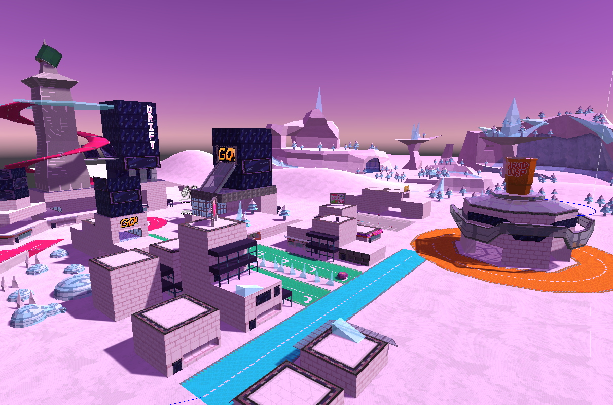
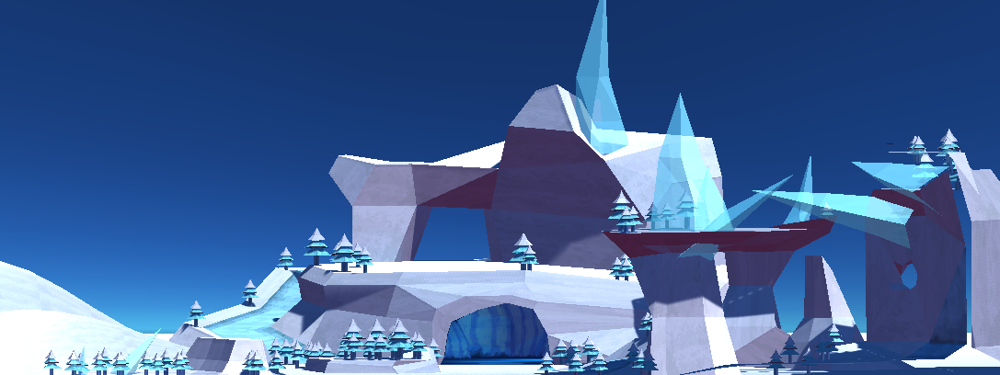

+++
title = "SPRODKART"
date = 2022-05-01

[extra]
era = "Started August 2022 (In Progress)"
thumbnail = "thumbnail.bmp"
tags = ["Unity Engine", "C#", "Blender"]
+++

**🚧 This page is currently under construction!**

SPRODKART (clearly a working title) is a game dev project I'm working on with a few close friends. It's an open-ended party racing game (emphasis on local, 4-player couch competitive play) that focuses on letting players throw together scrappy strategies and experience chaotic progression. Players must balance exploring the environment, upgrading vehicles, and disrupting opponents in preparation for a race for points. The game takes places in a large map with many distinct regions; each with certain quirks, such as a propensity for certain vehicles to spawn, or varying power up drop distributions, for example. Within a ten-minute timeframe, players need to put together a vehicle build, counter the strategies and builds of others, and hone their navigational skills to survive the specific events, conditions, and final race of each unique match.

Within this project, each member of our small team works on a wide variety of tasks and features. Personally, I've mainly worked on gameplay and UI programming, 3D modeling, texture work, and misc. organizational and administrative tasks up until now. Some specific features I've worked on so far include the gamemode logic, vehicle abilities, entity spawning behavior, player HUD, and dismounted player movement.

## Gameplay

The gameplay of SPRODKART consists of two phases, a prep phase and a race phase:

### Prep Phase

During the prep phase, players prepare for the race phase, where the bulk of points can be won. During this phase:

* Stat boost power ups can be collected, increasing a specific stat of any vehicle that player rides.
* Vehicles can be found, sold, traded (... and destroyed). Players will need to keep an eye on the time and ensure they end up with the vehicle they want once the race phase begins.
* Points can be accrued. While most points are won during the race phase, players can get a head start by gaining points through exploration, selling vehicles (smuggling them across the map for greater payouts), and taking bounties on other players. It's a tradeoff to balance time between gaining points like this and preparing for the final race.
* Random events occur. A thick layer of fog covering the map, increased power up drops for a certain stats, a barrage of orbital lasers and many other scenarios unfold a few times each round.

### Race Phase

During the race phase, players are teleported to a start line and race between randomly-distributed checkpoints around the open map, competing for points based on their placement. Our design goal is to make this phase important, but not the single determining factor of the match's results. We're aiming to have the player that wins (places first overall) in the race phase win the entire match 70% of the time, and will specifically study this metric in our technical prototypes and playtesting sessions.

## Vehicles

One major theme of SPRODKART is an emphasis on unique and visually striking vehicles ("somewhat deranged" shows up in our design document a lot) that each offer different base stats, abilities, and even control schemes. Each is likely to change a lot over the course of development, but these are some early forms of a few vehicles:


  {{ figure(src="sk-car-koi.bmp", caption="The Power Koi vehicle. Heavy and with a high top speed, this vehicle rides the snow like waves and comes with considerable offensive capabilities. Create wakes to make your overtakes pack a punch by pushing away opponents, and conjure geysers ahead of your path to throw enemies into the air -- or yourself towards a high-up shortcut.") }}
  {{ figure(src="sk-car-slurp.bmp", caption="The Grand Slurp is the proprietary vehicle of the common convenience store chain 21-Eight Sixty Three. Fueled by giant cups of free-refilled soda, any semblance of sane handling is sacrificed for incredible top speed and a sustained boost ability. Players will want to invest in compensating for its flaws before the final race begins.") }}
  {{ figure(src="sk-car-pop.bmp", caption="The Party Popper doesn't exactly have an engine. While sheer willpower lets it barely accelerate and turn to an extent, this vehicle relies on its short-cooldown abilities to move. With both a confetti-laden frontstep and backstep, those who master its movement have hair-trigger control over this machine's velocity. Great for dodging and weaving -- and near-limitlessly accelerating in the air.") }}
  {{ figure(src="sk-car-bug.bmp", caption="The Dark Bug is a vehicle focused on relentlessly attacking foes. Despite its low top speed, high handling and drift boosts let it close in and intercept opponents that get careless. This vehicle can cast a debuff on others within a range, decreasing their top speed and leaving them vulnerable to the vehicle's other ability: a short-range but high-damage suplex that throws enemies straight towards last place.") }}


Vehicle movement was implemented to mirror patterns commonly found in popular kart-racing games. Our goal with this project is to let the complexity arise from vehicle and stat builds, rather than tough or complicated controls. The vehicle physics themselves were created with raycasts acting both as suspensions systems and vehicle "wheels," giving the game a somewhat bouncy feel when the spring parameters are tuned correctly. In the vein of other kart-racing games, our vehicles drift upon landing on the ground while a button is held, a state that allows them to build up a boost after a few seconds.


  {{ figure(src="./driftin.mp4", caption="Footage of our early drifting in the Torus vehicle. Vehicles start with low base stats, so the speed and drift boost in this clip are both low. The effects are also... very WIP.", vid="true") }}


School and work obligations (alongside Unity Engine drama) have put our development progress on pause, but we haven't abandoned the project! We're working on it bit by bit, as our schedules afford, and are excited to polish this into a full game eventually.
